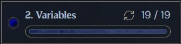

# 🐍 Python Variables — My Learning Journey

This project documents what I’ve learned about **variables in Python** from the **CS50's Introduction to Programming with Python** course.  
It includes examples, notes, and assignments I completed while practicing.

---

## 📚 What I Learned

### 🔹 Basic Concepts

- How to declare and use variables
- The difference between integers, floats, strings, and booleans
- How to perform simple math operations using variables
- Updating and reassigning variable values
- Writing comments to explain code

---

## 🖼 Screenshot

Here’s an example of my variable practice:

---

## 🔗 Reference

You can also check the original lesson here: [Boot.dev Python Variables Lesson](https://www.boot.dev/lessons/7e87cdd3-1dc9-44b0-acc0-a96a40485bc0)
