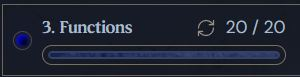

# ⚙️ Python Functions — My Learning Journey

This project documents what I’ve learned about **functions in Python** from the **CS50's Introduction to Programming with Python** course and **Boot.dev**.  
It includes all the lessons, exercises, and examples I practiced while learning how functions work.

---

## 📚 What I Learned

### 🔹 Function Basics

- How to define and call functions using `def`
- Understanding **parameters** and **arguments**
- The difference between **printing** and **returning** values
- Using **default parameter values**
- How to organize and declare functions properly

### 🔹 Advanced Function Concepts

- Returning multiple values from a function
- The `None` return type and when it’s used
- Function order and scope (why function placement matters)
- How to combine multiple functions in a single program
- Understanding **parameter vs argument** clearly

### 🔹 Practical Exercises

- **Archmage Function** – understanding default values
- **Curse Function** – using multiple return values
- **Enchant and Attack Function** – combining string and math operations inside a function
- Wrote multiple small programs using return statements effectively

---

## 🧠 Topics Covered

1. Functions
2. Function Review
3. Multiple Parameters
4. Printing vs. Returning
5. Where to Declare Functions
6. Order of Functions
7. None Return
8. Multiple Return Values
9. Parameters vs. Arguments
10. Default Values
11. Archmage
12. Curse
13. Enchant and Attack

---

## 🖼 Screenshot

Here’s a preview from my function practice:

---

## 🔗 Reference

You can also check the original lesson here:  
[Boot.dev — Python Functions Lesson](https://www.boot.dev/lessons/b4f5a4ef-9fb0-40f7-9dc6-baf28fe1be36)

---

### ✨ Summary

Through these exercises, I’ve learned how functions make code **modular**, **reusable**, and **easier to debug**.  
It’s one of the most powerful features in Python programming.
