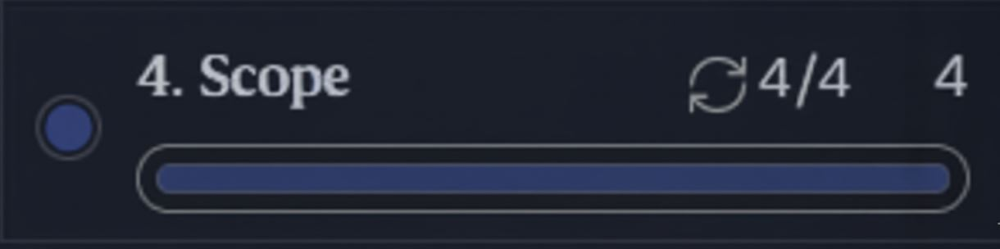

# 🌍 Python Scope — My Learning Journey

This project documents what I’ve learned about **scope in Python** from the **CS50's Introduction to Programming with Python** course and **Boot.dev**.  
It includes examples, notes, and exercises I completed while practicing how variables behave in different scopes.

---

## 📚 What I Learned

### 🔹 Scope Basics

- What **scope** means in programming
- How variable visibility depends on where it’s declared
- Understanding the difference between **local** and **global** variables

### 🔹 Global Scope

- How variables declared outside of functions can be accessed globally
- Using the `global` keyword to modify global variables inside functions
- Why global variables should be used carefully

### 🔹 Practical Exercises

- Practiced identifying variable scope in different examples
- Fixed code that caused **scope-related errors**
- Learned how to avoid overwriting global variables accidentally

---

## 🧠 Topics Covered

1. Scope
2. Global Scope
3. Quiz

---

## 🖼 Screenshot

Here’s a preview from my scope learning practice:

---

## 🔗 Reference

You can also check the original lesson here:  
[Boot.dev — Python Scope Lesson](https://www.boot.dev/lessons/9559d85f-1d27-4e8c-bc2b-8f66155450c1)

---

### ✨ Summary

Learning about **scope** helped me understand how Python handles variables within and outside of functions.  
It’s an essential concept for writing **clean**, **organized**, and **bug-free** code.
